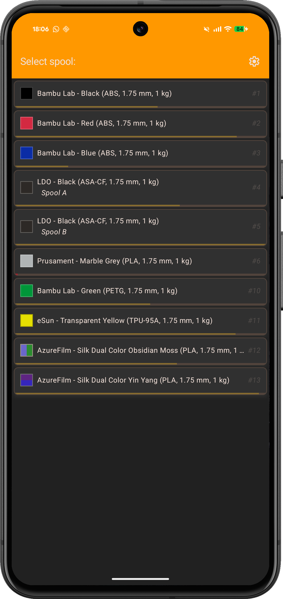
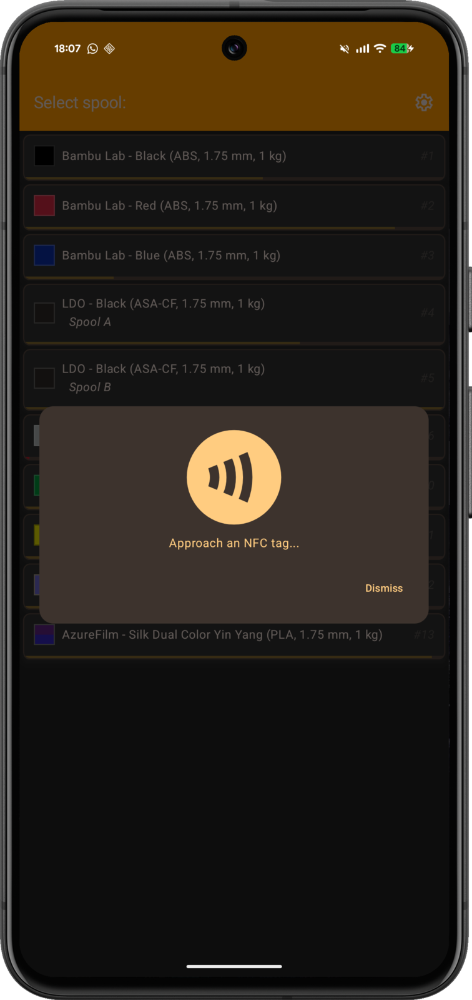
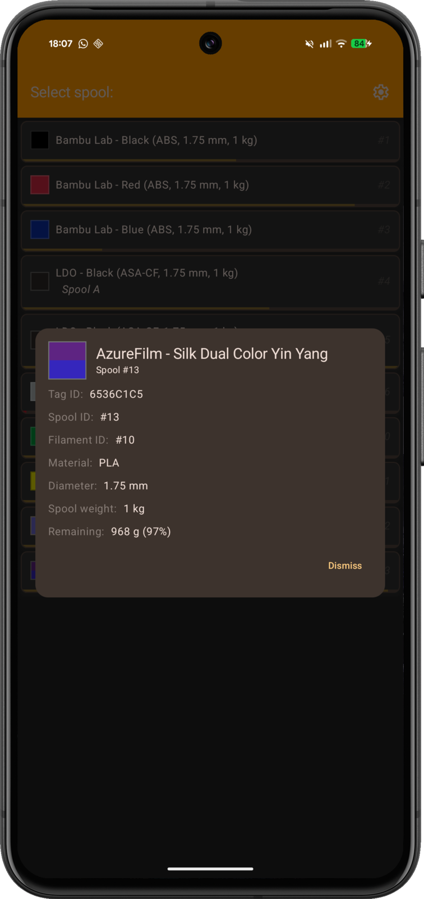

# :iphone: Android App - Spoolman Companion

An Android app that connects to a Spoolman server, lets you select a spool, and writes its identifiers to NFC/RFID tags.

Combined with [nfc2klipper](https://github.com/bofh69/nfc2klipper) it allows you to quickly load filament from a simple NFC tag.

# Overview

SpoolCompanion pulls your spools from Spoolman, shows key filament details at a glance, and supports both NFC write and read flows. It also displays remaining filament directly on the list cards for fast identification.

I made this app because I was tired of having to go to the printer NFC reader/writer to enroll new tags in my collection.

This app lets you simply choose a spool - from your [Spoolman](https://github.com/Donkie/Spoolman) database - and write the associated NFC tag.

And all this, from your mobile phone !

## Highlights

- Spool list with color swatches, material, diameter, weight, and remaining filament bar.
- NFC write flow with a dedicated dialog and safe error handling for non‑NDEF tags.
- NFC read flow that shows tag details and spool information when available.

## Screenshots

<table>
  <tr>
    <td align="center" valign="top">
      
    </td>
    <td align="center" valign="top">
      
    </td>
    <td align="center" valign="top">
      
    </td>
  </tr>
  <tr>
    <td align="center" valign="top">
      <strong>Spool Radar</strong> 
      The full list with color swatches and remaining filament bars.
    </td>
    <td align="center" valign="top">
      <strong>Write Mode</strong> 
      Tap a spool, approach a tag, and write instantly.
    </td>
    <td align="center" valign="top">
      <strong>Read Mode</strong> 
      Scan a tag to see spool details at a glance.
    </td>
  </tr>
</table>

## Tech

I am a completely noob in Android app development, this was my first app using Kotlin and Jetpack Compose. It was a nice learning project, I'll try to keep it updated and bring in new features.

> [!WARNING]  
> I haven't tested this app on several devices, and it is still an early development.
> 
> User shall use this app with caution, and at their own risks.
