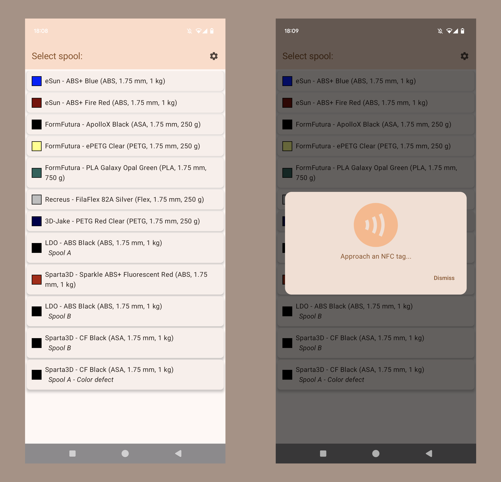

# :iphone: Android App - Spoolman Companion

A quick Android app that allows you to write NDEF records on NFC/RFID tags, from your mobile phone.

Combined with [nfc2klipper](https://github.com/bofh69/nfc2klipper) it allows you to quickly load filament from a simple NFC tag.

# Overview

I made this app because I was tired of having to go to the printer NFC reader/writer to enroll new tags in my collection.

This app lets you simply choose a spool - from your [Spoolman](https://github.com/Donkie/Spoolman) database - and write the associated NFC tag. 

And all this, from your mobile phone !

## Tech

I am a completely noob in Android app development, this was my first app using Kotlin and Jetpack Compose. It was a nice learning project, I'll try to keep it updated and bring in new features.

> [!WARNING]  
> I haven't tested this app on several devices, and it is still an early development.
> 
> User shall use this app with caution, and at their own risks.

## TODO
 - [ ] Handle a Spoolman property (like `tag_written`) to retrieve/record if this spool has a tag attached (and filter the list ?)
 - [ ] Implement a better UI theme + Dark and Light variants
 - [ ] Implement an app icon